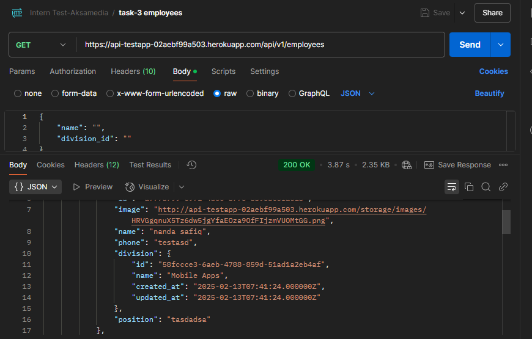

# Backend Developer Intern Test - PT Aksamedia Mulia Digital

## Dockumentasi Postman

## Daftar Isi
- [Instalasi](#instalasi)
- [Struktur API](#struktur-api)
- [Database Structure](#database-structure)
- [Task Implementasi](#task-implementasi)
- [Bonus SQL](#bonus-sql)
- [Lisensi](#lisensi)

Dockumentasi Postman : https://documenter.getpostman.com/view/22804089/2sAYXCjyTo

## Requirement
- Laravel
- MySQL/MariaDB
- PhpMyAdmin / Adminer / HeidiSQL
- Postman

### Tugas 1: Membuat API Login
URL: `https://api-testapp-02aebf99a503.herokuapp.com/api/v1/login`
- **Endpoint:** `/login`
- **Method:** `POST`

### Tugas 2: Membuat API Get All Data Divisi
URL: `https://api-testapp-02aebf99a503.herokuapp.com/api/v1/divisions`
- **Endpoint:** `/divisions`
- **Method:** `GET`
- **Fitur:** Bisa difilter berdasarkan nama
- **Data Dummy:** (Mobile Apps, QA, Full Stack, Backend, Frontend, UI/UX Designer)

### Tugas 3: Membuat API Get All Data Karyawan
URL: `https://api-testapp-02aebf99a503.herokuapp.com/api/v1/employees`
- **Endpoint:** `/employees`
- **Method:** `GET`
- **Fitur:** Bisa difilter berdasarkan nama dan divisi

### Tugas 4: Membuat API Create Data Karyawan
URL: `https://api-testapp-02aebf99a503.herokuapp.com/api/v1/employees`
- **Endpoint:** `/employees`
- **Method:** `POST`

### Tugas 5: Membuat API Update Data Karyawan
URL: `https://api-testapp-02aebf99a503.herokuapp.com/api/v1/employees/{uuid pegawai}`
- **Endpoint:** `/employees/{uuid pegawai}`
- **Method:** `PUT`

### Tugas 6: Membuat API Delete Data Karyawan

URL: `public/image/task6.png`
- **Endpoint:** `https://api-testapp-02aebf99a503.herokuapp.com/api/v1/employee/{uuid pegawai}`
- **Method:** `DELETE`

### Tugas 7: Membuat API Logout
URL: `https://api-testapp-02aebf99a503.herokuapp.com/api/v1/logout`
- **Endpoint:** `/logout`
- **Method:** `POST`
- **Expected Response Format:**

## Aturan Pengerjaan
1. API tugas 1 hanya bisa diakses ketika belum login atau tanpa autentikasi, jika ada autentikasi maka ditolak ✅.
2. API tugas 2 sampai 7 hanya bisa diakses ketika sudah login, jika belum login atau tanpa autentikasi maka ditolak ✅.
3. Manfaatkan fitur Laravel dengan sebaik-baiknya seperti penggunaan request validation, Eloquent, dan lainnya ✅.
4. Deploy hasil karya kalian dan kumpulkan link GitHub beserta link hasil deploy ✅.

---

# TES BACKEND (SQL) -> BONUS NILAI ✅.
Tes ini dirancang untuk mengevaluasi pemahaman Anda dalam SQL.

## Requirement
- Laravel
- MySQL/MariaDB
- PhpMyAdmin / Adminer / HeidiSQL

### Tugas
Buatkan kode dengan: 

URL: `public/image/bonus1.png`

URL: `public/image/bonus2.png`
- **Endpoint:** `https://api-testapp-02aebf99a503.herokuapp.com/api/v1/nilaiRT`
- **Endpoint:** `https://api-testapp-02aebf99a503.herokuapp.com/api/v1/nilaiST`

### Aturan
- Perhitungan wajib menggunakan SQL, penggunaan Collection hanya diperbolehkan untuk pengolahan data terakhir (grouping).

### Petunjuk
- Untuk nilai RT menggunakan `materi_uji_id = 7`, tetapi tidak mengikutkan `pelajaran_khusus`  ✅.
- Untuk nilai ST menggunakan `materi_uji_id = 4` dengan perhitungan:
  - `pelajaran_id 44` dikali **41.67**  ✅
  - `pelajaran_id 45` dikali **29.67**  ✅
  - `pelajaran_id 46` dikali **100**  ✅
  - `pelajaran_id 47` dikali **23.81**  ✅
- Hasil akhir harus diurutkan dari total nilai terbesar  ✅.

