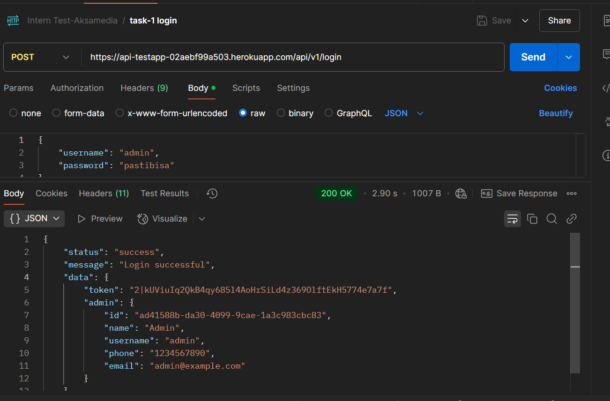
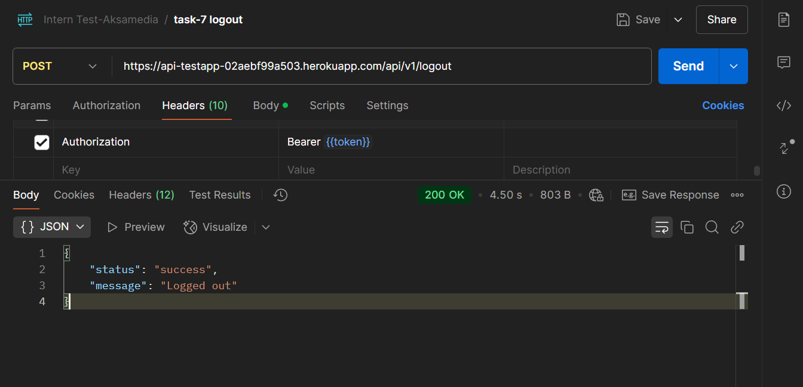

# Backend Developer Intern Test - PT Aksamedia Mulia Digital

[](https://laravel.com)
[](https://php.net)
[](LICENSE)

## Dokumentasi Postman
[](https://documenter.getpostman.com/view/22804089/2sAYXCjyTo)

## Daftar Isi
- [Instalasi](#instalasi)
- [Struktur Folder](#struktur-folder)
- [Tugas Implementasi](#tugas-implementasi)
  - [API Login](#1-api-login)
  - [API Get All Data Divisi](#2-api-get-all-data-divisi)
  - [API Get All Data Karyawan](#3-api-get-all-data-karyawan)
  - [API Create Data Karyawan](#4-api-create-data-karyawan)
  - [API Update Data Karyawan](#5-api-update-data-karyawan)
  - [API Delete Data Karyawan](#6-api-delete-data-karyawan)
  - [API Logout](#7-api-logout)
- [Aturan Pengerjaan](#aturan-pengerjaan)
- [Tes Backend (SQL) - Bonus Nilai](#tes-backend-sql---bonus-nilai)
  - [Tugas](#tugas)
  - [Aturan SQL](#aturan-sql)
  - [Petunjuk](#petunjuk)
- [Lisensi](#lisensi)

## Instalasi
```bash
git clone https://github.com/your-repository.git
cd your-repository
composer install
cp .env.example .env
php artisan key:generate
php artisan migrate --seed
php artisan serve
```

## Struktur Folder
```
├── app
│   ├── Http
│   │   ├── Controllers
│   │   │   ├── AuthController.php
│   │   │   ├── DivisionController.php
│   │   │   ├── EmployeeController.php
│   │   │   ├── NilaiController.php
│   ├── Models
│   │   ├── Admin.php
│   │   ├── Division.php
│   │   ├── Employee.php
│   │   ├── User.php
├── bootstrap
│   ├── cache
├── config
├── routes
│   ├── api.php
│   ├── web.php
├── database
│   ├── factories
│   │   ├── UserFactory.php
│   ├── migrations
│   │   ├── 0001_01_01_000000_create_users_table.php
│   │   ├── 0001_01_01_000002_create_cache_table.php
│   │   ├── 0001_01_01_000003_create_jobs_table.php
│   │   ├── 2025_02_12_122831_create_admins_table.php
│   │   ├── 2025_02_12_123011_create_divisions_table.php
│   │   ├── 2025_02_12_123019_create_employees_table.php
│   │   ├── 2025_02_12_130134_create_personal_access_tokens_table.php
│   │   ├── 2025_02_13_035641_create_nilai_table.php
│   │   ├── 2025_02_13_040751_create_pelajaran_table.php
│   ├── seeders
│   │   ├── AdminSeeder.php
│   │   ├── DatabaseSeeder.php
│   │   ├── DivisionSeeder.php
│   │   ├── NilaiSeeder.php
│   │   ├── PelajaranSeeder.php
│   ├── database.sqlite
```

## Requirement
- Laravel 10.x
- MySQL/MariaDB
- PhpMyAdmin / Adminer / HeidiSQL
- Postman

## Tugas Implementasi
### [1. API Login](#1-api-login)
- **URL:** `https://api-testapp-02aebf99a503.herokuapp.com/api/v1/login`
- **Endpoint:** `/login`
- **Method:** `POST`



### [2. API Get All Data Divisi](#2-api-get-all-data-divisi)
- **URL:** `https://api-testapp-02aebf99a503.herokuapp.com/api/v1/divisions`
- **Endpoint:** `/divisions`
- **Method:** `GET`
- **Fitur:** Filter berdasarkan nama
- **Data Dummy:** Mobile Apps, QA, Full Stack, Backend, Frontend, UI/UX Designer


### [3. API Get All Data Karyawan](#3-api-get-all-data-karyawan)
- **URL:** `https://api-testapp-02aebf99a503.herokuapp.com/api/v1/employees`
- **Endpoint:** `/employees`
- **Method:** `GET`
- **Fitur:** Filter berdasarkan nama dan divisi


### [4. API Create Data Karyawan](#4-api-create-data-karyawan)
- **URL:** `https://api-testapp-02aebf99a503.herokuapp.com/api/v1/employees`
- **Endpoint:** `/employees`
- **Method:** `POST`


### [5. API Update Data Karyawan](#5-api-update-data-karyawan)
- **URL:** `https://api-testapp-02aebf99a503.herokuapp.com/api/v1/employees/{uuid}`
- **Endpoint:** `/employees/{uuid}`
- **Method:** `PUT`


### [6. API Delete Data Karyawan](#6-api-delete-data-karyawan)
- **URL:** `https://api-testapp-02aebf99a503.herokuapp.com/api/v1/employees/{uuid}`
- **Endpoint:** `/employees/{uuid}`
- **Method:** `DELETE`


### [7. API Logout](#7-api-logout)
- **URL:** `https://api-testapp-02aebf99a503.herokuapp.com/api/v1/logout`
- **Endpoint:** `/logout`
- **Method:** `POST`
- **Response Format:**



## Aturan Pengerjaan
1. **API Login** hanya bisa diakses ketika belum login atau tanpa autentikasi. Jika sudah login, akses akan ditolak ✅.
2. **API Get dan CRUD Data** hanya bisa diakses ketika sudah login. Jika belum login, akses akan ditolak ✅.
3. Gunakan fitur Laravel seperti request validation, Eloquent, dan lainnya sebaik mungkin ✅.
4. Deploy aplikasi dan kumpulkan **link GitHub** beserta **link hasil deploy** ✅.

---

## [Tes Backend (SQL) - Bonus Nilai](#tes-backend-sql---bonus-nilai) ✅
Tes ini bertujuan untuk menguji pemahaman Anda dalam SQL.

### [Tugas](#tugas)
Buatkan kode SQL untuk:
- **Endpoint:** `https://api-testapp-02aebf99a503.herokuapp.com/api/v1/nilaiRT`
- **Endpoint:** `https://api-testapp-02aebf99a503.herokuapp.com/api/v1/nilaiST`


### [Aturan SQL](#aturan-sql)
- Perhitungan wajib menggunakan **SQL Query**, bukan koleksi Laravel ✅.
- Koleksi hanya boleh digunakan untuk tahap akhir (grouping) ✅.

### [Petunjuk](#petunjuk)
- **Nilai RT** menggunakan `materi_uji_id = 7` tanpa memasukkan `pelajaran_khusus` ✅.
- **Nilai ST** menggunakan `materi_uji_id = 4` dengan aturan:
  - `pelajaran_id 44` dikali **41.67** ✅
  - `pelajaran_id 45` dikali **29.67** ✅
  - `pelajaran_id 46` dikali **100** ✅
  - `pelajaran_id 47` dikali **23.81** ✅
- Hasil akhir **diurutkan dari total nilai terbesar** ✅.

---

## [Lisensi](#lisensi)
Proyek ini dilisensikan di bawah Lisensi MIT - lihat file [LICENSE](LICENSE) untuk detail lebih lanjut.

